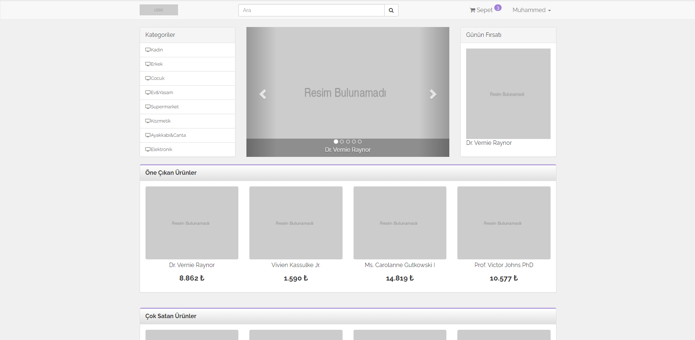
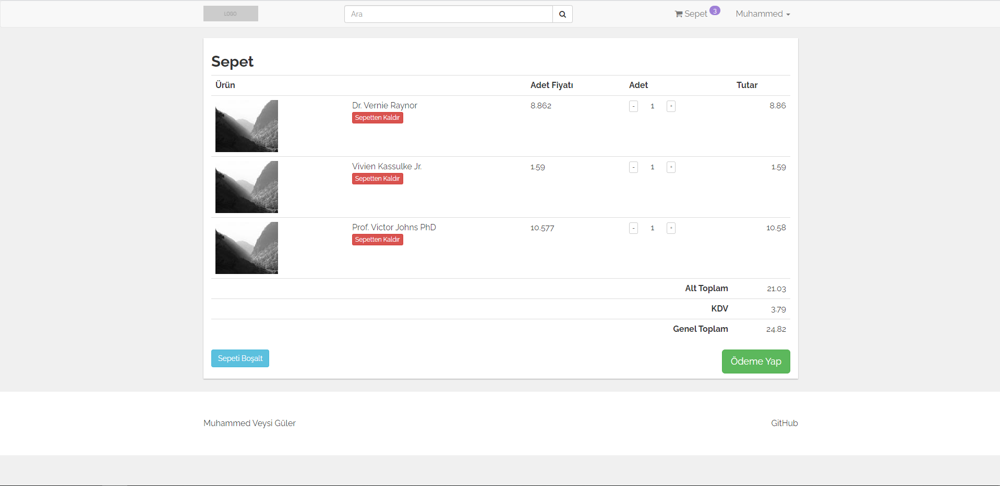
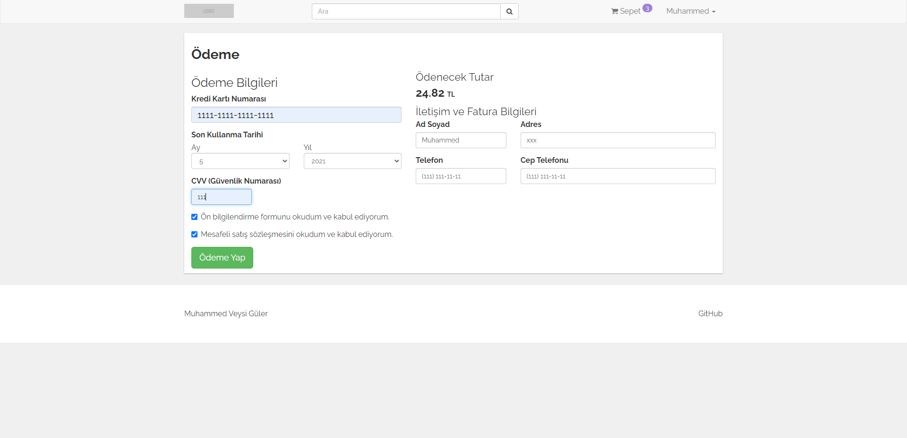
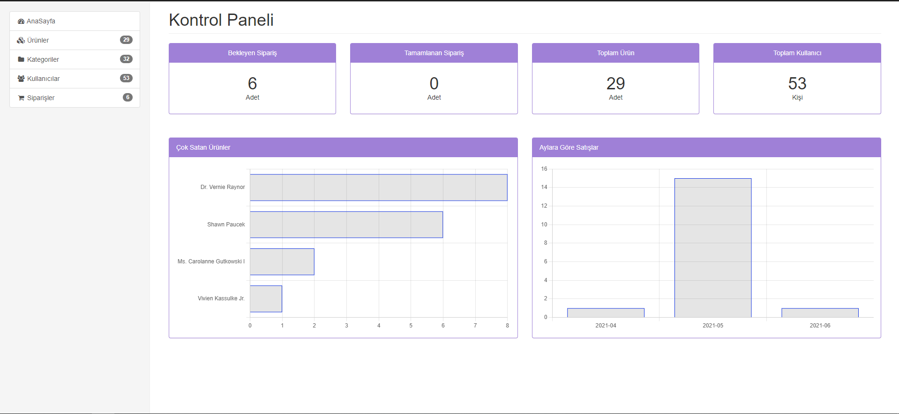
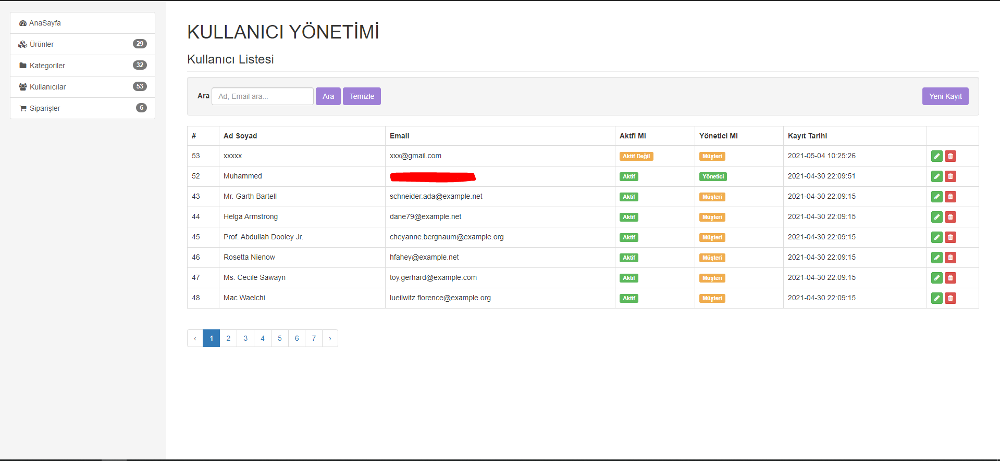
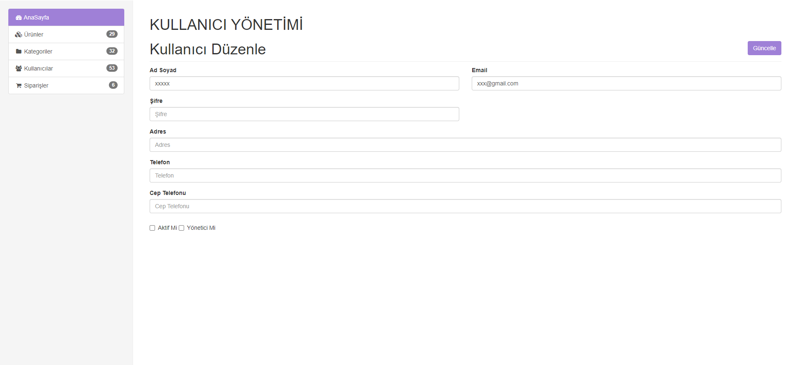
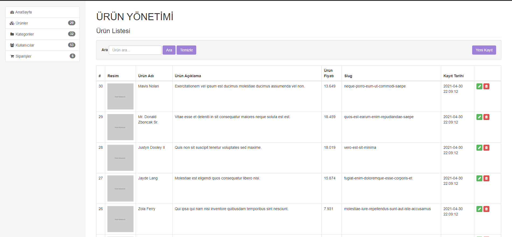
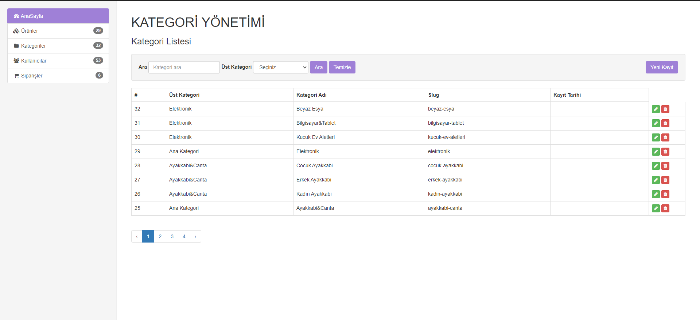
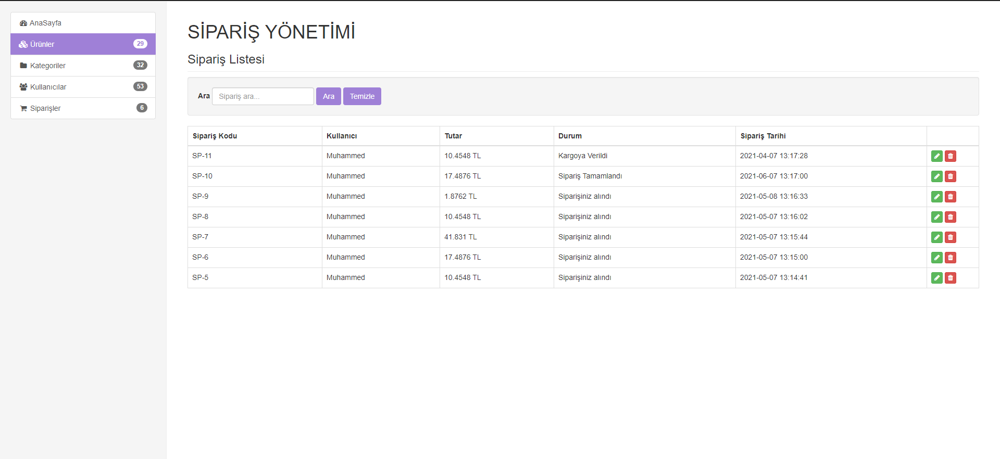

# Laravel eTicaret Sitesi
<b>Mysql Kullanılmıştır</b> 

# AÇIKLAMA
<ul>
<li>Kullanıcı ürünlere bakabilir, üye olup sepete eklediği ürünleri satın alabilir</li>
<li>Yönetici Kullanıcı ekler, siler, düzenler</li>
<li>Yönetici Ürün ekler, siler, düzenler</li>
<li>Yönetici Kategori ekler, siler, düzenler</li>
<li>Yönetici Siparişleri yönetir</li>

</ul>
# EKRAN GÖRÜNTÜLERİ
  

